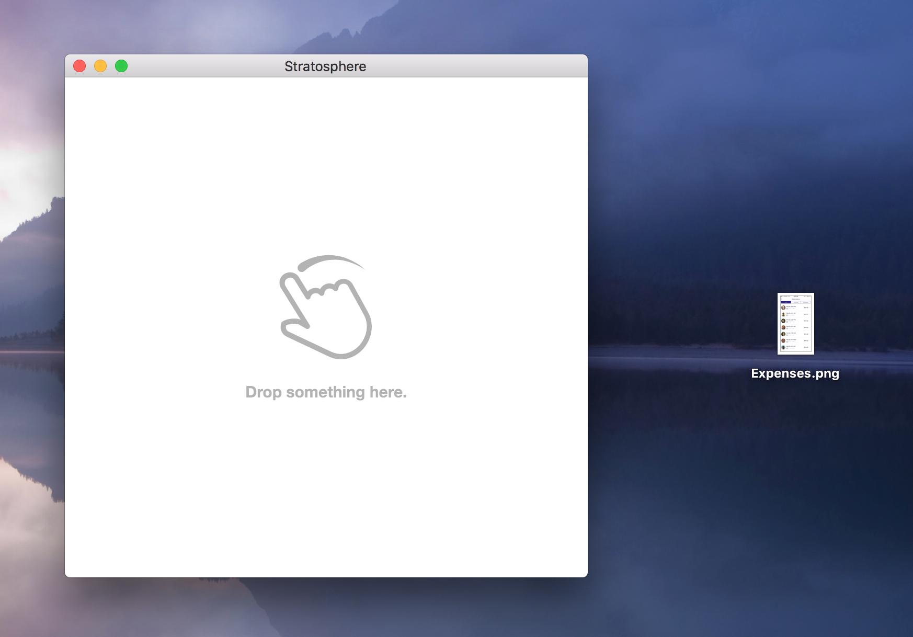

# Stratosphere (alpha)

A general-purpose window that is always on top. Drop files and URLs onto it.

Similar to [Helium.app](http://heliumfloats.com/) but written in
[Electron](https://electron.atom.io), so it's cross-platform.

Click this image to watch a little screencast:

[](https://cloudup.com/cBP1qVWMWV3)

## Usage

There are no builds yet, so you gotta roll your own for now:

```sh
git clone https://github.com/zeke/stratosphere
cd stratosphere
npm install
npm start
```

## License

MIT
